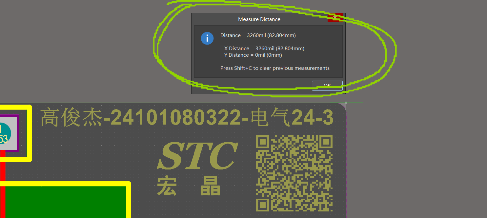
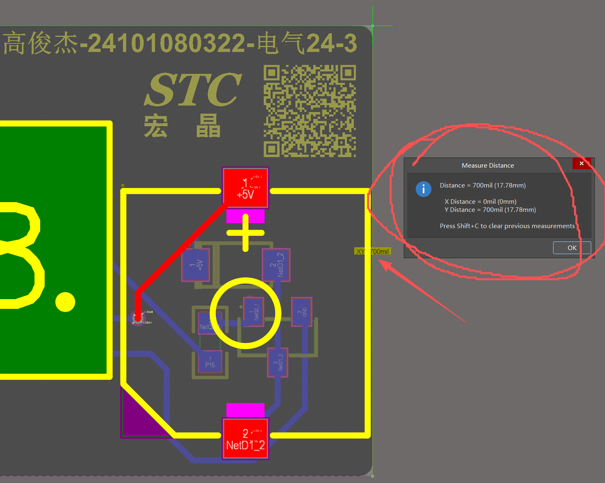
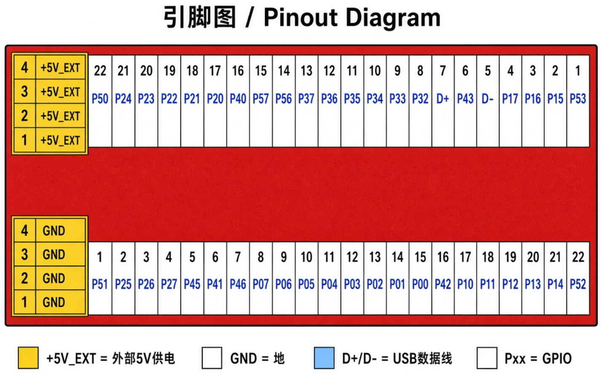

# AI8051U 开发条

**基于宏晶科技 AI8051U 的超小尺寸开发板**

8.28 cm × 1.79 cm ｜ 长宽比 5 : 1 ｜ 44 个引脚全部引出 ｜ 可直插面包板

电气24-3　高俊杰　24101080322

---

| [一、概述](#一概述) | [七、焊接提示](#七焊接提示) |
| :--- | :--- |
| [二、供电部分](#二供电部分) | [八、拓展](#八拓展) |
| [三、防反接设计](#三防反接设计) | [九、引脚图](#九引脚图) |
| [四、功能模块](#四功能模块) | [十、工程文件](#十工程文件) |
| [五、板子尺寸与设计](#五板子尺寸与设计) | [十一、后记](#十一后记) |
| [六、布局布线](#六布局布线) | |

---

## 核心参数

| 项目 | 参数 |
| :--- | :--- |
| 主控 | 宏晶科技 AI8051U（48 脚） |
| 板卡尺寸 | 长 8.28 cm × 宽 1.79 cm |
| 供电 | Type-C 供电；2.54 排针外部 5V 供电（防反接） |
| 稳压 | AMS1117 5V 降 3V3，PI 型滤波 |
| 显示 | 4 位八段式共阴极数码管 + CH455G 驱动电路 |
| 交互 | 4 个独立功能按键，独立复位电路 |
| 存储 | 一片 16K EEPROM（AT24C16） |
| 扩展 | 电源指示灯、有源蜂鸣器 |
| 引脚 | 44 个引脚全部引出 |
| 焊接 | 全部手焊，不需要贴片机、不需要过炉子 |

---

## 一、概述

本项目为一个基于宏晶科技 AI8051U 的开发板，尺寸极小，可与面包板适配便于开发，扫描板身上的二维码即可获取 github 链接获取引脚图等资料。设计时主要考虑三点：

- **一是尽可能高地提高集成度。**
- **二是一定要能够用手焊接**，不需要贴片机、不需要过炉子。
- **三是元件便宜好买**，立创商城备件多。

最终历经多轮迭代，在长 8.28 厘米、宽 1.79 厘米的空间内（约为中指长大拇指宽）塞进去了：

> 一颗 48 脚的 mcu、type-c 供电、一个 ldo、两个 pi 型滤波、电源指示灯（扩展部分）、蜂鸣器（扩展部分）、4 路按键模块、4 位数码管及其驱动芯片、一片 16K EEPROM、一路通过 2.54 排针进行连接的 5v 供电（防反接）、独立复位电路、以及 44 个引脚全部引出。

---

## 二、供电部分

使用一颗 **AMS1117** 做 5V 降 3V3 稳压输出，使用 **PI 型滤波**过滤输出纹波。

## 三、防反接设计

板子使用了两种供电设计：

- 使用 **USB Type-C** 供电时不可能反接。
- 使用 **2.54 排针**做外部供电时，使用一颗 **PMOS** 做成的理想二极管防反接。

## 四、功能模块

| 模块 | 说明 |
| :--- | :--- |
| 复位电路 | 这颗芯片的外围复位电路非常简单，内置高性能复位电路，可以把复位脚复用为普通 io 口，宏晶甚至以此作为卖点，只需一个下拉电阻 + 按键即可实现独立的按键复位，这里保险起见还是用了阻容。 |
| 显示模块 | 搭载 4 位八段式共阴极数码管 + 基于 CH455G 的驱动电路，满足数字显示基础功能需求。 |
| 按键输入模块 | 板载 4 个独立功能输入按键（不含复位按键），作为自定义功能输入接口。 |
| 外部存储模块 | 搭载一片 AT24C16 EEPROM。 |
| 外接端子 | 所有未使用引脚全部引出，扫描板身上的二维码即可跳转到开源链接，获取引脚图。 |

## 五、板子尺寸与设计

板子尺寸非常小，长 **8.28 厘米**，宽 **1.79 厘米**，便于携带，体积小巧，搭载在设备上占据空间小，长宽比高达 **5 比 1**，因此其实是一根“开发条”。

并且两条 2.54 1*24 排针的设计间距恰好能够插在面包板上，方便开发。

（如图为测量结果）

  
  

## 六、布局布线

- 功率部分使用铜皮连接，过流能力大阻抗小。
- 铺铜尽量对称，防止用加热台焊接时翘边。

## 七、焊接提示

如果手焊，建议**先焊接 Type-C 和 MCU**，否则空间较小不方便烙铁拖动；后续的元器件焊接很简单，**最后焊接排针**。

## 八、拓展

| 功能 | 说明 |
| :--- | :--- |
| 供电指示 | 通过两颗 led 检测 3v3 和 5v 供电是否正常。 |
| 蜂鸣器 | 自带一个有源蜂鸣器，可以实现相应声音提示。 |

---

## 九、引脚图

| 标识 | 含义 |
| :--- | :--- |
| +5V_EXT | 外部 5V 供电 |
| GND | 地 |
| D+ / D- | USB 数据线 |
| Pxx | GPIO |

---

## 十、工程文件

| 文件 | 说明 |
| :--- | :--- |
| `GJJ真正的大作业.PrjPcb` | Altium Designer 工程文件 |
| `Sheet1.SchDoc`、`Sheet2.SchDoc` | 原理图 |
| `PCB1.PcbDoc` | PCB 源文件 |
| `PcbLib1.PcbLib` | 元件封装库 |
| `GJJ真正的大作业.OutJob` | 输出作业配置 |
| `GJJ真正的大作业.pdf` | 原理图与 PCB 打印 |

---

## 十一、后记

这个工程我打算有时间打个板子看看，已将工程开源在

github：<https://github.com/GaoJunjie-2006/dian_zi_dian_lu_cad.git>

电气24-3 高俊杰倾情奉献

---

> 说明：本 README 由 Claude 根据设计报告整理撰写。
> 如有疑问或修改建议，欢迎提交 [Issue](https://github.com/GaoJunjie-2006/dian_zi_dian_lu_cad/issues)。
